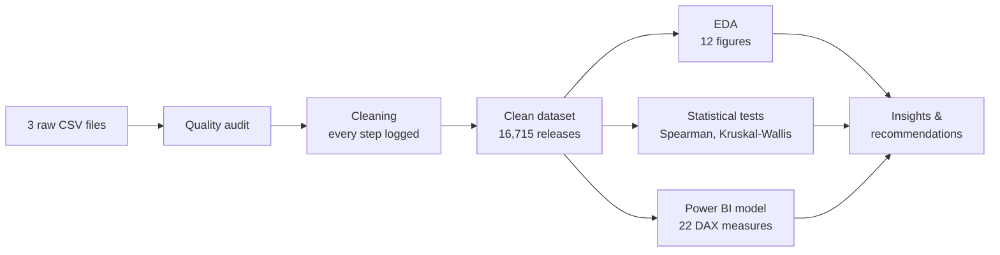

<div align="center">

# 🎮 Video Game Market Analytics

### What sells in the video game market?
**An end-to-end analysis of 16,715 releases, from raw data to business decisions (1980-2016)**

[](https://colab.research.google.com/github/koffifidelek59-collab/video-game-analytics/blob/main/Video-Game-Analytics.ipynb)


**Data quality audit · Cleaning · Exploratory analysis · Statistical testing · Interactive Power BI dashboard · Business recommendations**


[The question](#-the-business-question) · [Key results](#-key-figures) · [Answers](#-seven-questions-seven-evidence-based-answers) · [Recommendations](#-recommendations) · [Dashboard](#%EF%B8%8F-the-dashboard) · [Method](#-method) · [Run it](#-run-it)

</div>

---

## 🎯 The business question

A gaming company wants to understand its market before committing budgets:

> **Which genres, platforms and publishers sell? Which games are the best sellers? How has the market evolved, which regions buy, and do good reviews translate into good sales?**

This project answers each question with evidence, in a reproducible pipeline that goes from **three raw files** to a **cleaned dataset**, a **tested analysis**, an **8-page interactive dashboard** and **actionable recommendations**.

> [!NOTE]
> Sales are expressed in **millions of units** (retail copies tracked by VGChartz), not in dollars.
> A **game** is a title (11,563); a **release** is a game on one platform (16,715).

## 📊 Key figures

| 🎮 Games | 💿 Releases | 📦 Units sold | 🏆 Top genre | 🕹️ Top platform | 🏢 Top publisher | ⭐ Releases above 1 M |
|:---:|:---:|:---:|:---:|:---:|:---:|:---:|
| **11,563** | **16,715** | **8,918 M** | **Action** | **PlayStation 2** | **Nintendo** | **12.4 %** |

## ❓ Seven questions, seven evidence-based answers

| # | Question | Answer | Evidence |
|:---:|---|---|:---:|
| **Q1** | Which genres are the most common? | **Action** (20 % of releases), then Sports and Misc. Per release, **Platform** (0.93 M) and **Shooter** (0.80 M) sell the most. | Fig. 1 |
| **Q2** | Which platforms sell the most? | **PS2** (1,256 M units, 14 %), then Xbox 360, PS3, Wii and DS. **Sony 40 %** and **Nintendo 39 %** of all units. | Fig. 2 |
| **Q3** | Which publishers sell the most? | **Nintendo** (1,789 M, 20 %, 2.53 M per release), then EA and Activision. The **top 10 publishers hold 70 %** of the market. | Fig. 3 |
| **Q4** | What are the best-selling games? | **Wii Sports** (82.5 M). Across platforms, **GTA V** is second (56.6 M on 5 platforms); two *Call of Duty* titles enter the top 10. | Fig. 4 |
| **Q5** | How have sales evolved? | Growth to a **peak in 2008** (672 M units), then **-60 %** of tracked retail sales by 2015, as digital and mobile gaming grew. | Fig. 5, 6 |
| **Q6** | Which regions buy the most? | **North America 49 %**, Europe 27 %, Japan 15 %. Japan is a distinct market: RPGs make **27 %** of its units, shooters only 3 %. | Fig. 7, 8 |
| **Q7** | Do ratings go with sales? | **Critic score: ρ = 0.39**, user score: ρ = 0.15. Median sales reach **1.54 M at 90+** against 0.12 M below 50; the link holds after controlling for visibility (**partial ρ = 0.26**). | Fig. 9, 10 |

### 🔍 Beyond the brief

- **A hit-driven market:** **6.6 %** of releases account for half of all units, while **35 %** sell fewer than 100,000 copies.
- **Games keep selling for years:** the same PS4 and Xbox One games sold **+29 %** more after December 2016. In this generation, Japan weighs only **4 %** of units and Europe (39 %) catches up with North America (43 %).

## 💡 Recommendations

| # | Recommendation | Why |
|:---:|---|---|
| 1 | **Choose genres by return per release, not by popularity** | Platform, Shooter, Sports and Racing have the highest medians; crowded genres (Adventure, Strategy, Puzzle) need differentiation or small budgets. |
| 2 | **Invest in quality as judged by critics** | Median sales jump above a critic score of 80 (0.59 M) and 90 (1.54 M). |
| 3 | **Release on several platforms** | The best third-party sellers (GTA V, Call of Duty) reach the top by adding platforms and generations. |
| 4 | **Adapt the offer to each region** | Shooters and sports for the West, role-playing games and handhelds for Japan, Europe as a first-rank market. |
| 5 | **Manage a portfolio of bets** | Sales are extremely skewed: plan with medians and hit probabilities, not averages. |
| 6 | **Exploit the back catalogue** | Games keep selling: price cuts, bundles, remasters and ports extend their life. |
| 7 | **Add digital sales to the data** | Retail-only figures understate recent years; complete them before deciding the future of a genre or platform. |

## 🖥️ The dashboard

**Power BI, 8 pages, "Neon Arcade" design:** illustrated background, page navigator, KPI cards with icons, translucent panels and one neon colour per chart. Four synchronised slicers (year, genre, manufacturer, platform), cross-filtering, Top N filters and tooltips.

| | |
|:---:|:---:|
|  **Overview** · KPIs, trend, regions, rankings |  **Genres & Platforms** · Q1, Q2, Q5 |
|  **Publishers & Games** · Q3, Q4 |  **Regions** · Q6 |
|  **Ratings & Sales** · Q7 |  **PS4 & Xbox One** · after 2016 |
|  **Insights** · findings and recommendations |  **Data Quality** · auditable cleaning log |

## 🧪 Method



### Data quality: issues found and treated

Every step is recorded in [`data/processed/cleaning_log.csv`](data/processed/cleaning_log.csv) and displayed on the dashboard's Data Quality page.

| Issue | Treatment |
|---|---|
| 2 rows without name and genre | Removed |
| 2 releases split into two records (*Madden NFL 13*, *Sonic the Hedgehog*, PS3) | Merged, sales added |
| 2 different games sharing one name (*Need for Speed: Most Wanted*, 2005 and 2012) | Both kept, 2012 reboot renamed |
| 4 impossible years (2017, 2020 in a file extracted in December 2016) | Set to missing, not guessed |
| 53 missing publishers | Written *Unknown* |
| Legacy ESRB code K-A | Recoded E (its post-1998 name) |
| Years and counts stored as decimals | Converted to integers |
| Console files in Mac Roman encoding, 512 zero-sales rows | Decoded, trimmed, rows removed |

**Result: 16,719 raw rows → 16,715 clean releases, 99.97 % of the units kept.**

### Statistical approach

- **Rank-based tests** (Spearman, Kruskal-Wallis), because sales are heavily skewed.
- **Effect sizes** reported with every p-value, and **95 % bootstrap confidence intervals**.
- A **partial correlation** that controls the critic score for the number of critics, to separate quality from visibility.

## 📁 Repository structure

```
video-game-analytics/
├── Video-Game-Analytics.ipynb      # Full analysis, step by step (runs in under 1 min on a CPU)
├── report.pdf                      # 23-page report: figures, dashboard captures, recommendations
├── report.tex                      # LaTeX source of the report
├── data/
│   ├── raw/                        # The three supplied files, unchanged
│   └── processed/                  # Written by the notebook
│       ├── video_games_clean.csv   # Clean dataset (16,715 releases, 25 columns)
│       ├── regional_sales.csv      # Regional sales in long format
│       ├── ps4_xone_clean.csv      # PS4 and Xbox One releases with sales
│       └── cleaning_log.csv        # Every cleaning step
├── powerbi/
│   ├── Video_Game_Analytics_Dashboard.pbit   # Power BI template (8 pages)
│   ├── PowerQuery_pipeline.m                 # Power Query (M) code
│   ├── DAX_measures.dax                      # The 22 DAX measures
│   ├── Dashboard_Build_Guide.md              # Open, check and adjust the dashboard
│   └── vg_theme.json                         # Neon Arcade theme
├── figures/                        # fig01-fig12 (PNG + PDF) and dashboard/ (8 page captures)
└── results/                        # KPI and result tables (CSV)
```

## 🚀 Run it

**Google Colab:** click the *Open in Colab* badge, then *Runtime → Run all*. Missing data files are downloaded from this repository automatically.

**Locally:**

```bash
git clone https://github.com/koffifidelek59-collab/video-game-analytics.git
cd video-game-analytics
pip install pandas numpy scipy matplotlib jupyter
jupyter notebook Video-Game-Analytics.ipynb
```

**Power BI dashboard:**

1. Open `powerbi/Video_Game_Analytics_Dashboard.pbit` in Power BI Desktop.
2. Set the **DataFolder** parameter to the full path of `data\processed\` (with the final backslash).
3. Click *Load*. Expected values for checking are listed in [`powerbi/Dashboard_Build_Guide.md`](powerbi/Dashboard_Build_Guide.md).

## 📚 Data sources and limitations

- Kirubi, R. (2016). *Video Game Sales with Ratings*, Kaggle: VGChartz sales and Metacritic scores, extracted on 22 December 2016.
- VGChartz: later snapshot of the PS4 and Xbox One catalogues.

> [!IMPORTANT]
> **Limitations:** retail units only (no revenue, digital or mobile sales); VGChartz figures are estimates; critic and user scores exist for about half of the releases; correlations describe associations, not causes.

## 🛠️ Tech stack

| Area | Tools |
|---|---|
| Analysis | Python 3.11 · pandas · NumPy · SciPy · Matplotlib |
| Environment | Jupyter · Google Colab |
| Business intelligence | Power BI Desktop · Power Query (M) · DAX |
| Reporting | LaTeX |

## 👤 Author

**KOUAME Koffi Fidèle**
Data Analysis Internship · Task 11
MSc Energy and Green Hydrogen (System Analysis), WASCAL IMP-EGH

📧 [koffifidelek59@gmail.com](mailto:koffifidelek59@gmail.com) · 🔗 [LinkedIn](https://www.linkedin.com/in/koffi-fidele-kouame/) · 🐙 [GitHub](https://github.com/koffifidelek59-collab)

## 📄 License

Code and documentation are released under the [MIT License](LICENSE). The data remain subject to the terms of their original sources.

<div align="center">

⭐ *If this project is useful to you, consider giving it a star.*

</div>
