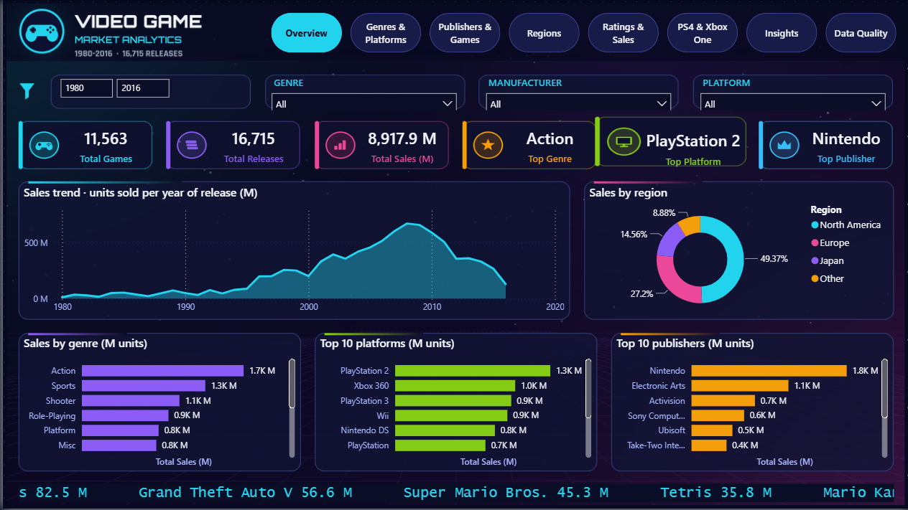
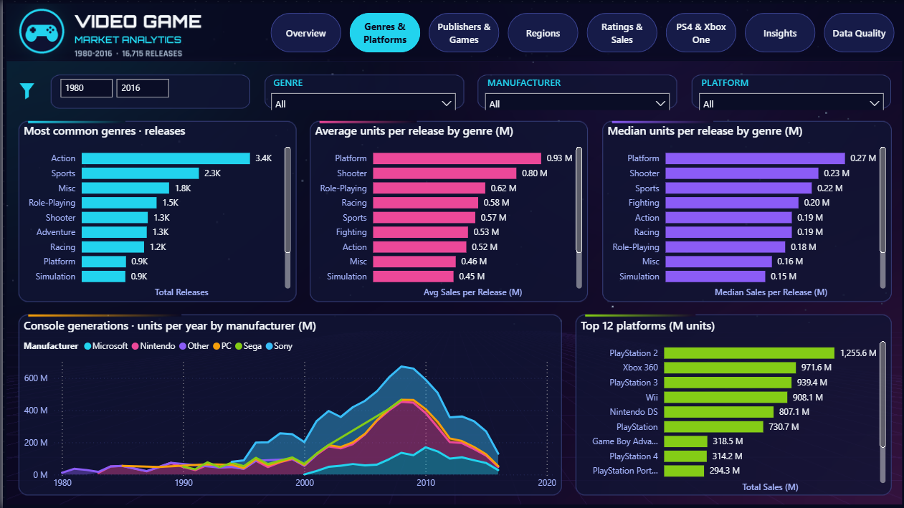
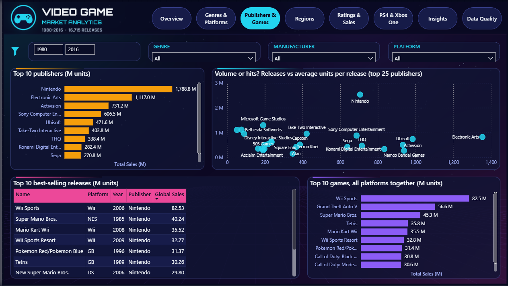
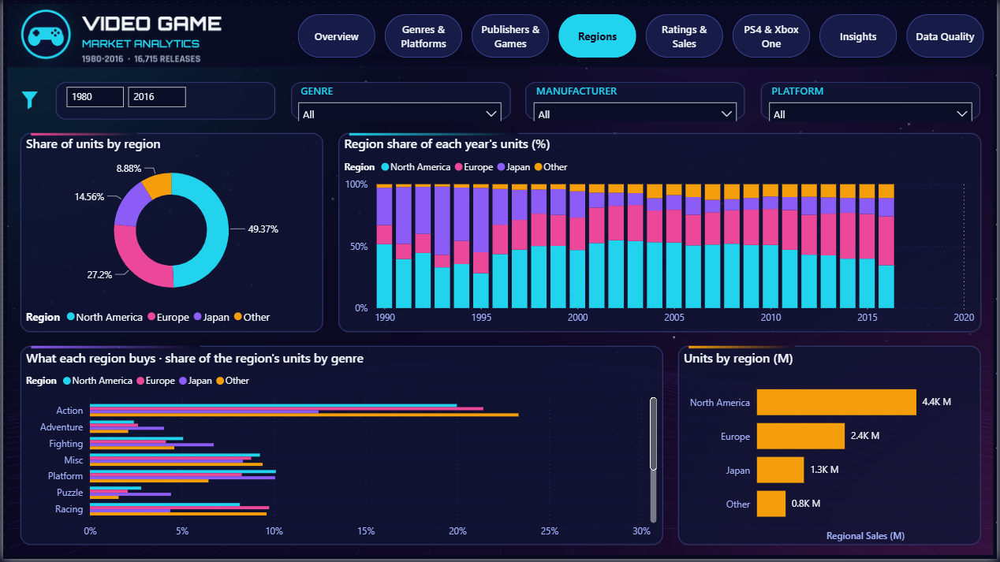
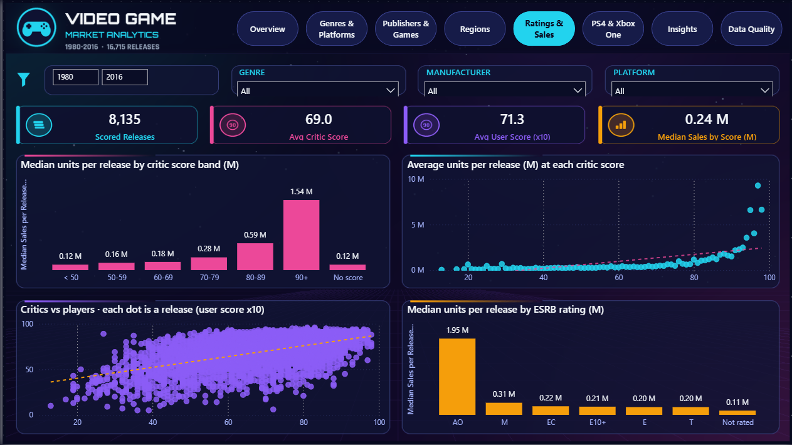
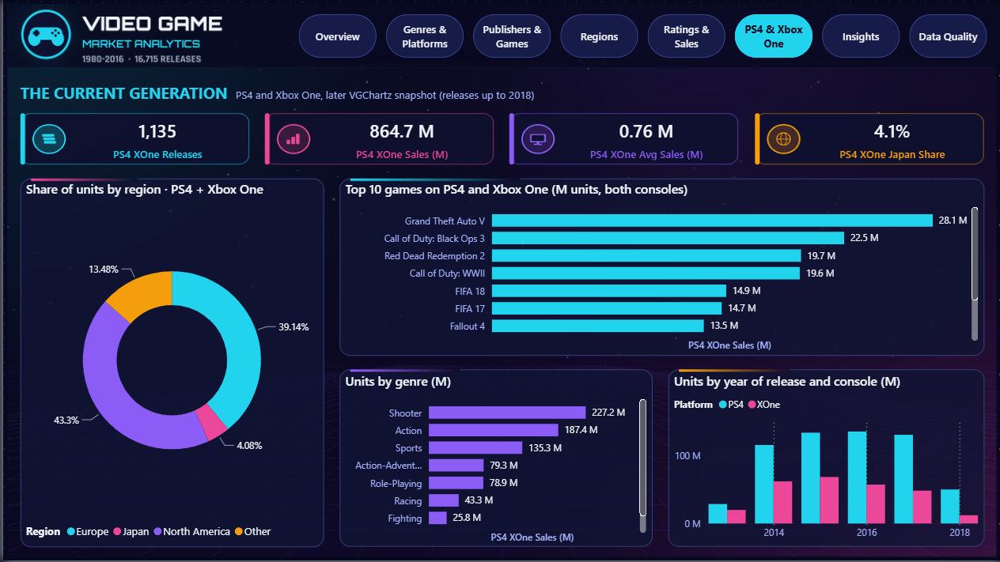
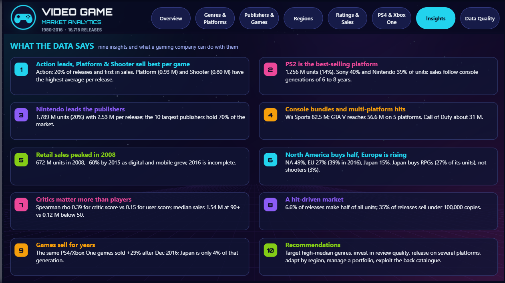
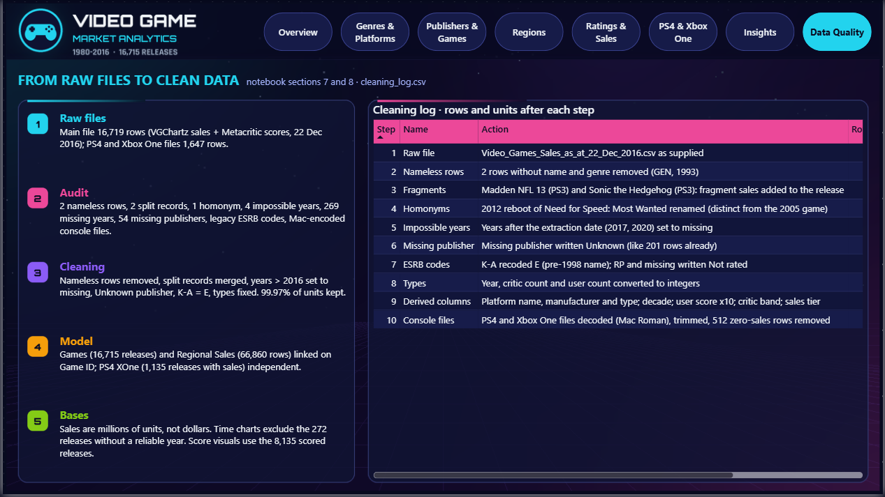
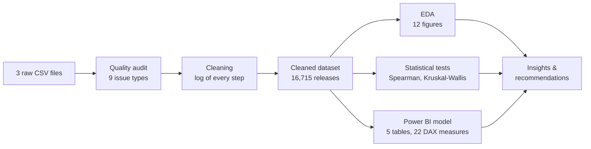

<div align="center">

# 🎮 Video Game Market Analytics

### What sells in the video game market? An end-to-end analysis of 16,715 releases (1980-2016)

[](https://colab.research.google.com/github/koffifidelek59-collab/video-game-analytics/blob/main/Video-Game-Analytics.ipynb)


**Data quality audit · Cleaning · Exploratory analysis · Statistical tests · Interactive Power BI dashboard · Business recommendations**



</div>

## 🎯 The business question

A company of the gaming industry wants to understand the video game market: **which genres, platforms and publishers sell, which games are the best sellers, how the market has changed, which regions buy, and whether good reviews go with good sales.** This project answers each question with evidence, from three raw files to a decision-ready dashboard.

> Sales are **millions of units** (retail copies tracked by VGChartz), not dollars. A *game* is a title (11,563); a *release* is a game on one platform (16,715).

## 📊 Key figures (no filter)

| 🎮 Games | 💿 Releases | 📦 Units sold | 🏆 Top genre | 🕹️ Top platform | 🏢 Top publisher | ⭐ Releases above 1 M |
|:---:|:---:|:---:|:---:|:---:|:---:|:---:|
| **11,563** | **16,715** | **8,918 M** | **Action** | **PlayStation 2** | **Nintendo** | **12.4 %** |

## ❓ The seven questions, answered

| # | Question | Answer | Evidence |
|---|---|---|---|
| Q1 | Most common genres? | **Action** (20 % of releases), then Sports and Misc. But **Platform** (0.93 M) and **Shooter** (0.80 M) sell the most *per release*. | Fig. 1 |
| Q2 | Platforms with the highest sales? | **PS2** (1,256 M units, 14 %), Xbox 360, PS3, Wii, DS. Sony 40 % and Nintendo 39 % of all units. | Fig. 2 |
| Q3 | Publishers with the highest sales? | **Nintendo** (1,789 M, 20 %, 2.53 M per release), EA, Activision. The top 10 publishers hold **70 %** of the market. | Fig. 3 |
| Q4 | Best-selling games? | **Wii Sports** (82.5 M). All platforms together: **GTA V** (56.6 M on 5 platforms), Call of Duty. | Fig. 4 |
| Q5 | Sales over the years? | Growth to a **peak in 2008** (672 M units), then **-60 %** of tracked retail sales to 2015 as digital and mobile grew. | Fig. 5, 6 |
| Q6 | Regions with the highest sales? | **North America 49 %**, Europe 27 % (first for 2016 releases), Japan 15 %, which buys RPGs (27 % of its units) and few shooters (3 %). | Fig. 7, 8 |
| Q7 | Ratings vs sales? | **Critic score: ρ = 0.39**, user score: ρ = 0.15. Median sales **1.54 M at 90+** vs 0.12 M below 50; the link survives the visibility effect (partial ρ = 0.26). | Fig. 9, 10 |

## 🔍 Beyond the brief

- **A hit-driven market:** 6.6 % of the releases make half of all units; 35 % sell fewer than 100,000 copies.
- **Games sell for years:** the same PS4 and Xbox One games sold **+29 %** after December 2016; in that generation Japan weighs only 4 %.

## 💡 Recommendations for a gaming company

1. **Choose genres by return per release, not by popularity:** high medians in Platform, Shooter, Sports, Racing; crowded genres (Adventure, Strategy, Puzzle) need differentiation or small budgets.
2. **Invest in quality as judged by the press:** median sales jump above a critic score of 80 (0.59 M) and 90 (1.54 M).
3. **Release on several platforms:** the best third-party sellers reach the top by adding platforms and generations.
4. **Adapt the offer to each region:** shooters and sports for the West, role-playing games and handhelds for Japan, Europe as a first-rank market.
5. **Manage a portfolio of bets:** plan with medians and hit probabilities, not averages.
6. **Exploit the back catalogue:** price cuts, bundles, remasters and ports.
7. **Add digital sales to the data** before deciding on the future of a genre or platform.

## 🖥️ The dashboard (Power BI, 8 pages)

Neon Arcade design: illustrated background, header with page navigator, KPI cards with icons, translucent panels, one neon colour per chart; four synchronised slicers (year, genre, manufacturer, platform), cross-filtering, Top N filters and tooltips.

| | |
|:---:|:---:|
|  **Overview** · KPIs, trend, regions, rankings |  **Genres & Platforms** · Q1, Q2, Q5 |
|  **Publishers & Games** · Q3, Q4 |  **Regions** · Q6 |
|  **Ratings & Sales** · Q7 |  **PS4 & Xbox One** · after 2016 |
|  **Insights** · findings and recommendations |  **Data Quality** · auditable cleaning log |

## 🧪 Method



**Data quality issues found and fixed** (all logged in `data/processed/cleaning_log.csv`, shown on the Data Quality page):

| Issue | Treatment |
|---|---|
| 2 rows without name and genre | removed |
| 2 split records of one release (*Madden NFL 13*, *Sonic the Hedgehog*, PS3) | merged, sales added |
| 2 different games with one name (*Need for Speed: Most Wanted* 2005 / 2012) | kept, 2012 renamed |
| 4 impossible years (2017, 2020 in a file extracted in Dec 2016) | set to missing, not guessed |
| 54 missing publishers, legacy ESRB code K-A | *Unknown*; K-A → E |
| Years and counts stored as decimals | integers |
| Console files in Mac Roman encoding with `\r` line breaks, 512 zero-sales rows | decoded, trimmed, removed |

**Result: 16,719 raw rows → 16,715 clean releases, 99.97 % of the units kept.**

**Statistics:** rank-based tests (sales are very skewed), effect sizes reported with every p-value, 95 % bootstrap intervals, and a partial correlation that controls the critic score for the number of critics (visibility).

## 📁 Repository structure

```
video-game-analytics/
├── Video-Game-Analytics.ipynb      # the full analysis, point by point (< 1 min on a CPU)
├── report.pdf                      # 22-page report with figures, dashboard captures and recommendations
├── report.tex                      # LaTeX source of the report
├── data/
│   ├── raw/                        # the three supplied files, unchanged
│   └── processed/                  # cleaned dataset + dashboard tables (written by the notebook)
│       ├── video_games_clean.csv       # THE cleaned dataset (16,715 releases, 25 columns)
│       ├── regional_sales.csv          # regional sales in long format
│       ├── ps4_xone_clean.csv          # PS4 / Xbox One releases with sales
│       └── cleaning_log.csv            # every cleaning step
├── powerbi/
│   ├── Video_Game_Analytics_Dashboard.pbit   # Power BI template (8 pages), reads data/processed/
│   ├── PowerQuery_pipeline.m                 # Power Query (M) code
│   ├── DAX_measures.dax                      # the 22 DAX measures
│   ├── Dashboard_Build_Guide.md              # open, check and adjust the dashboard
│   └── vg_theme.json                         # Neon Arcade theme
├── figures/                        # fig01-fig12 (analysis) and dashboard/ (8 page captures)
└── results/                        # KPI and result tables (CSV)
```

## 🚀 Run it

**Notebook in Google Colab:** click the badge at the top, then *Runtime → Run all*. Missing data files are downloaded from this repository.

**Locally:**
```bash
git clone https://github.com/koffifidelek59-collab/video-game-analytics.git
cd video-game-analytics
pip install pandas numpy scipy matplotlib jupyter
jupyter notebook Video-Game-Analytics.ipynb
```

**Dashboard:** open `powerbi/Video_Game_Analytics_Dashboard.pbit` in Power BI Desktop, set **DataFolder** to the full path of `data\processed\` (with the final backslash), then *Load*. The expected values are listed in [`powerbi/Dashboard_Build_Guide.md`](powerbi/Dashboard_Build_Guide.md).

## 📚 Data sources

- Kirubi, R. (2016). *Video Game Sales with Ratings*, Kaggle: VGChartz sales and Metacritic scores, extraction of 22 December 2016.
- VGChartz: later snapshot of the PS4 and Xbox One catalogues.

**Limits:** retail units only (no revenue, digital or mobile sales); VGChartz figures are estimates; scores exist for half of the releases; correlations are associations, not causes.

## 🛠️ Tools

Python (pandas, NumPy, SciPy, Matplotlib) · Jupyter / Google Colab · Power BI Desktop (Power Query, DAX) · LaTeX

## 👤 Author

**KOUAME Koffi Fidèle** · Data Analysis Internship (Task 11)
MSc Energy and Green Hydrogen (System Analysis), WASCAL IMP-EGH
📧 koffifidelek59@gmail.com · 🔗 [LinkedIn](https://www.linkedin.com/in/koffi-fidele-kouame/) · 🐙 [GitHub](https://github.com/koffifidelek59-collab)

Code and documentation under the [MIT License](LICENSE); the data keep the terms of their sources.
