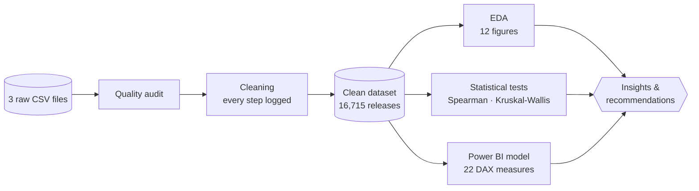

<div align="center">


<br>

[](https://colab.research.google.com/github/koffifidelek59-collab/video-game-analytics/blob/main/Video-Game-Analytics.ipynb)


**Data quality audit &nbsp;·&nbsp; Cleaning &nbsp;·&nbsp; Exploratory analysis &nbsp;·&nbsp; Statistical testing &nbsp;·&nbsp; Power BI dashboard &nbsp;·&nbsp; Recommendations**

<sub>

[**Question**](#-the-business-question) &nbsp;•&nbsp; [**Answers**](#-seven-questions-seven-answers) &nbsp;•&nbsp; [**Recommendations**](#-recommendations) &nbsp;•&nbsp; [**Dashboard**](#-the-dashboard) &nbsp;•&nbsp; [**Method**](#-method) &nbsp;•&nbsp; [**Run it**](#-run-it)

</sub>

</div>

<br>

## 🎯 The business question

A gaming company wants to understand its market before committing budgets:

<table>
<tr>
<td>

**Which genres, platforms and publishers sell? Which games are the best sellers? How has the market evolved, which regions buy, and do good reviews translate into good sales?**

</td>
</tr>
</table>

This project answers each question with evidence, through a reproducible pipeline: **three raw files → a clean dataset → a tested analysis → an 8-page interactive dashboard → actionable recommendations.**


> [!NOTE]
> Sales are in **millions of units** (retail copies tracked by VGChartz), not dollars. A **game** is a title (11,563); a **release** is a game on one platform (16,715).

<br>

## ❓ Seven questions, seven answers

| | Question | Answer | |
|:---:|---|---|:---:|
| **Q1** | **Most common genres?** | **Action** leads with 20 % of releases, then Sports and Misc. Per release, **Platform** (0.93 M) and **Shooter** (0.80 M) sell the most. | <sub>Fig. 1</sub> |
| **Q2** | **Top platforms?** | **PS2** (1,256 M units, 14 %), then Xbox 360, PS3, Wii and DS. **Sony 40 %** and **Nintendo 39 %** of all units. | <sub>Fig. 2</sub> |
| **Q3** | **Top publishers?** | **Nintendo** (1,789 M, 20 %, 2.53 M per release), then EA and Activision. The **top 10 hold 70 %** of the market. | <sub>Fig. 3</sub> |
| **Q4** | **Best-selling games?** | **Wii Sports** (82.5 M). Across platforms, **GTA V** follows (56.6 M on 5 platforms); two *Call of Duty* titles enter the top 10. | <sub>Fig. 4</sub> |
| **Q5** | **Sales over time?** | Growth to a **peak in 2008** (672 M units), then **-60 %** of tracked retail sales by 2015, as digital and mobile grew. | <sub>Fig. 5-6</sub> |
| **Q6** | **Top regions?** | **North America 49 %**, Europe 27 %, Japan 15 %. Japan is distinct: RPGs make **27 %** of its units, shooters only 3 %. | <sub>Fig. 7-8</sub> |
| **Q7** | **Ratings vs sales?** | **Critic score ρ = 0.39**, user score ρ = 0.15. Median sales **1.54 M at 90+** vs 0.12 M below 50; the link holds after controlling for visibility (**partial ρ = 0.26**). | <sub>Fig. 9-10</sub> |

<table>
<tr>
<td width="50%" valign="top">

### 🎯 A hit-driven market
**6.6 %** of releases make **half of all units**, while **35 %** sell fewer than 100,000 copies.

</td>
<td width="50%" valign="top">

### ⏳ Games keep selling
The same PS4 and Xbox One games sold **+29 %** more after December 2016. In this generation Japan weighs only **4 %** of units.

</td>
</tr>
</table>

<br>

## 💡 Recommendations

| | Recommendation | Evidence |
|:---:|---|---|
| **1** | 🎲 **Choose genres by return per release, not popularity** | Platform, Shooter, Sports and Racing have the highest medians; crowded genres need differentiation or small budgets. |
| **2** | ⭐ **Invest in quality as judged by critics** | Median sales jump above a critic score of 80 (0.59 M) and 90 (1.54 M). |
| **3** | 🕹️ **Release on several platforms** | GTA V and Call of Duty reach the top by adding platforms and generations. |
| **4** | 🌍 **Adapt the offer to each region** | Shooters and sports for the West, RPGs and handhelds for Japan, Europe as a first-rank market. |
| **5** | 📊 **Manage a portfolio of bets** | Sales are extremely skewed: plan with medians and hit probabilities, not averages. |
| **6** | 📚 **Exploit the back catalogue** | Price cuts, bundles, remasters and ports extend the life of a game. |
| **7** | 🌐 **Add digital sales to the data** | Retail-only figures understate recent years. |

<br>

## 🖥 The dashboard

<div align="center">

**Power BI · 8 pages · Neon Arcade design**<br>
<sub>Page navigator · KPI cards · 4 synchronised slicers (year, genre, manufacturer, platform) · cross-filtering · Top N filters · tooltips</sub>

</div>

<table>
<tr>
<td width="50%" align="center"><br><b>Overview</b><br><sub>KPIs, trend, regions, rankings</sub></td>
<td width="50%" align="center"><br><b>Genres & Platforms</b><br><sub>Q1 · Q2 · Q5</sub></td>
</tr>
<tr>
<td align="center"><br><b>Publishers & Games</b><br><sub>Q3 · Q4</sub></td>
<td align="center"><br><b>Regions</b><br><sub>Q6</sub></td>
</tr>
<tr>
<td align="center"><br><b>Ratings & Sales</b><br><sub>Q7</sub></td>
<td align="center"><br><b>PS4 & Xbox One</b><br><sub>After 2016</sub></td>
</tr>
<tr>
<td align="center"><br><b>Insights</b><br><sub>Findings and recommendations</sub></td>
<td align="center"><br><b>Data Quality</b><br><sub>Auditable cleaning log</sub></td>
</tr>
</table>

<br>

## 🧪 Method



<details>
<summary><b>🧹 Data quality: issues found and treated</b> <sub>(click to expand)</sub></summary>
<br>

Every step is recorded in [`data/processed/cleaning_log.csv`](data/processed/cleaning_log.csv) and shown on the dashboard's Data Quality page.

| Issue | Treatment |
|---|---|
| 2 rows without name and genre | Removed |
| 2 releases split into two records (*Madden NFL 13*, *Sonic the Hedgehog*, PS3) | Merged, sales added |
| 2 different games sharing one name (*Need for Speed: Most Wanted*, 2005 and 2012) | Both kept, 2012 reboot renamed |
| 4 impossible years (2017, 2020 in a file extracted in December 2016) | Set to missing, not guessed |
| 53 missing publishers | Written *Unknown* |
| Legacy ESRB code K-A | Recoded E |
| Years and counts stored as decimals | Converted to integers |
| Console files in Mac Roman encoding, 512 zero-sales rows | Decoded, trimmed, rows removed |

**16,719 raw rows → 16,715 clean releases, 99.97 % of the units kept.**

</details>

<details>
<summary><b>📐 Statistical approach</b> <sub>(click to expand)</sub></summary>
<br>

- **Rank-based tests** (Spearman, Kruskal-Wallis), because sales are heavily skewed.
- **Effect sizes** reported with every p-value, with **95 % bootstrap confidence intervals**.
- A **partial correlation** controls the critic score for the number of critics, to separate quality from visibility.

</details>

<details>
<summary><b>📁 Repository structure</b> <sub>(click to expand)</sub></summary>
<br>

```
video-game-analytics/
├── Video-Game-Analytics.ipynb      # Full analysis, step by step (under 1 min on a CPU)
├── report.pdf                      # 23-page report: figures, dashboard, recommendations
├── report.tex                      # LaTeX source of the report
├── data/
│   ├── raw/                        # The three supplied files, unchanged
│   └── processed/                  # Written by the notebook
│       ├── video_games_clean.csv   # Clean dataset (16,715 releases, 25 columns)
│       ├── regional_sales.csv      # Regional sales in long format
│       ├── ps4_xone_clean.csv      # PS4 and Xbox One releases with sales
│       └── cleaning_log.csv        # Every cleaning step
├── powerbi/
│   ├── Video_Game_Analytics_Dashboard.pbit   # Power BI template (8 pages)
│   ├── PowerQuery_pipeline.m                 # Power Query (M) code
│   ├── DAX_measures.dax                      # The 22 DAX measures
│   ├── Dashboard_Build_Guide.md              # Open, check and adjust the dashboard
│   └── vg_theme.json                         # Neon Arcade theme
├── figures/                        # fig01-fig12 (PNG + PDF), dashboard/ and readme/ visuals
└── results/                        # KPI and result tables (CSV)
```

</details>

<br>

## 🚀 Run it

<table>
<tr>
<td width="50%" valign="top">

**☁️ Google Colab**

Click **Open in Colab** above, then *Runtime → Run all*.<br>
Missing data files are downloaded automatically.

</td>
<td width="50%" valign="top">

**📊 Power BI**

1. Open `powerbi/Video_Game_Analytics_Dashboard.pbit`.
2. Set **DataFolder** to the full path of `data\processed\`.
3. Click *Load*; expected values are in the [build guide](powerbi/Dashboard_Build_Guide.md).

</td>
</tr>
</table>

**💻 Locally**

```bash
git clone https://github.com/koffifidelek59-collab/video-game-analytics.git
cd video-game-analytics
pip install pandas numpy scipy matplotlib jupyter
jupyter notebook Video-Game-Analytics.ipynb
```

<br>

## 📚 Data sources and limitations

- **Kirubi, R. (2016).** *Video Game Sales with Ratings*, Kaggle: VGChartz sales and Metacritic scores, extracted on 22 December 2016.
- **VGChartz:** later snapshot of the PS4 and Xbox One catalogues.

> [!IMPORTANT]
> Retail units only (no revenue, digital or mobile sales) · VGChartz figures are estimates · scores exist for about half of the releases · correlations describe associations, not causes.

<br>

## 🛠 Tech stack

<div align="center">


</div>

<br>

## 👤 Author

<table>
<tr>
<td>

**KOUAME Koffi Fidèle**<br>
Data Analysis Internship · Task 11<br>
MSc Energy and Green Hydrogen (System Analysis), WASCAL IMP-EGH

[](mailto:koffifidelek59@gmail.com)
[](https://www.linkedin.com/in/koffi-fidele-kouame/)
[](https://github.com/koffifidelek59-collab)

</td>
</tr>
</table>

<div align="center">

<sub>Code and documentation under the [MIT License](LICENSE) · data under the terms of their original sources</sub>

⭐ **If this project is useful to you, consider giving it a star.**

</div>
